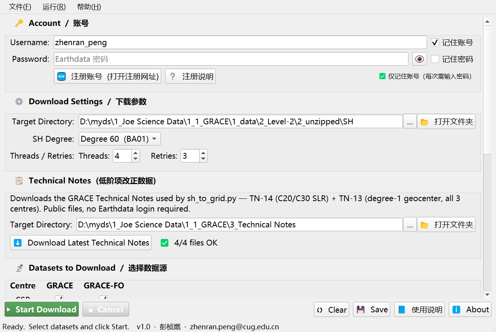
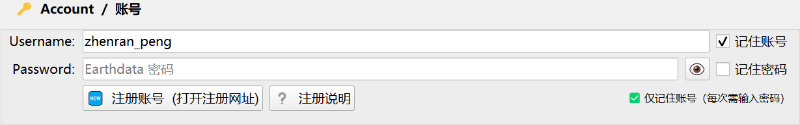
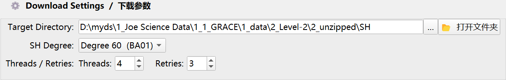
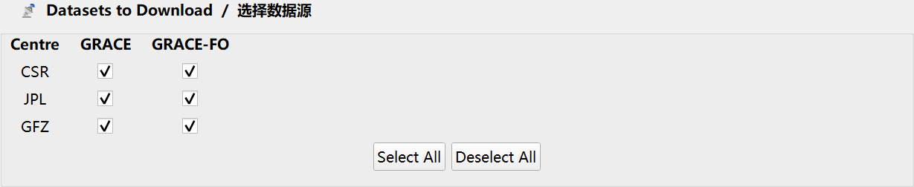

# GRACE Downloader — GRACE / GRACE-FO Level-2 球谐系数下载器

[](LICENSE)
[]()
[]()

从 **NASA PO.DAAC** 批量下载 **GRACE / GRACE-FO Level-2 月重力场球谐系数（GSM）**，
并一键获取低阶项改正所需的 **GRACE Technical Notes（TN-13 / TN-14）**。
图形界面，断点续传，打包版**不需要安装 Python**。



> **不写代码也能直接用**：Windows 安装程序见
> **[Releases](https://github.com/pengzhenran/GRACE-Downloader/releases/latest)**
> （`GRACE_Downloader_Setup_v1.0.1.exe`，约 50 MB，安装后约 124 MB，不需要管理员权限）。

---

## 1. 功能

| 功能 | 说明 |
|------|------|
| 月重力场 GSM 下载 | **CSR / JPL / GFZ** 三家 × **GRACE（RL06）** / **GRACE-FO（RL06.3）** |
| 阶数选择 | **Degree 60**（`BA01`，默认）/ **Degree 96**（`BB01`，存入 `deg96\` 子目录，互不覆盖） |
| Technical Notes | TN-14（C20 / C30 SLR 改正）、TN-13（degree-1 地心改正，三家中心），**公开文件、无需账号** |
| 断点续传 | 自动跳过本地已有文件，可反复运行只补缺失部分 |
| 记住账号 / 记住密码 | 两个**独立**开关，可只记其一；取消勾选立即删除本机保存内容 |
| 注册引导 | 一键打开 NASA Earthdata 官方注册页，内置注册步骤与账号规则 |
| 界面语言 | 中文 / English 双语标签 |
| 日志 | 全过程日志，可清空 / 保存为 txt |

## 2. 使用前准备

1. 注册 **NASA Earthdata** 账号：<https://urs.earthdata.nasa.gov/users/new>
   - 用户名：4–30 位小写字母 / 数字 / `.` / `_`
   - 密码：≥ 12 位，含大写字母、小写字母、数字、特殊字符各至少一个
   - 注册后到邮箱点激活链接
2. 确认电脑能访问 `urs.earthdata.nasa.gov`、`cmr.earthdata.nasa.gov`、`podaac.jpl.nasa.gov`
   （服务器位于海外，必要时自备网络条件）

> 本软件**只负责下载与目录整理**，不修改原始数据。球谐系数 → 等效水高（EWH）的转换
> 需要额外的处理与改正（如 GIA 等），不在本软件范围内。

## 3. 快速开始（4 步）

1. **填账号**：在 `🔑 Account` 区输入 Earthdata 用户名与密码；需要自动填入就勾选
   「记住账号」「记住密码」。
2. **选目录**：在 `⚙️ Download Settings` 区选好 Target Directory（可点「📂 打开文件夹」查看）。
3. **选数据源**：默认全选 CSR / JPL / GFZ × GRACE / GRACE-FO，按需取消。
4. **点开始**：`▶ Start Download`，进度与日志实时显示；中断后再点一次即可继续补齐。

| 账号区 | 下载参数 |
|---|---|
|  |  |



## 4. 下载结果目录结构

```
<目标目录>/
├── CSR/            # 60 阶: GSM-2_*_BA01_*
├── JPL/
├── GFZ/
└── deg96/          # 96 阶: GSM-2_*_BB01_*
    ├── CSR/
    ├── JPL/
    └── GFZ/
```

文件名示例 `GSM-2_2002095-2002120_GRAC_UTCSR_BA01_0600`：

| 字段 | 含义 |
|------|------|
| `BA01` / `BB01` | 60 阶 / 96 阶 |
| `0600` / `0603` | GRACE RL06 / GRACE-FO RL06.3 |
| `UTCSR` | 处理中心（CSR / JPL / GFZ） |

## 5. 安装与运行方式

### 方式一：安装程序（推荐）

从 [Releases](https://github.com/pengzhenran/GRACE-Downloader/releases/latest) 下载
`GRACE_Downloader_Setup_v1.0.1.exe`，双击按向导安装：

- 默认装到 `%LOCALAPPDATA%\Programs\GRACE Downloader`（**不需要管理员权限**）
- 自动创建开始菜单项（程序 / 使用说明 / 卸载）与可选桌面快捷方式

### 方式二：从源码运行

```bash
python -m pip install PyQt5 earthaccess
python src/grace_downloader_gui_release.py
```

### 方式三：自行打包

见 [`docs/构建与打包.md`](docs/构建与打包.md)（PyInstaller + Inno Setup，`src/` 内含
`grace_downloader_release.spec`、`installer_release.iss`、`build_release.bat`）。

安装后可做自检：

```
GRACE_Downloader.exe --self-test          # 检查依赖与文件是否齐全
GRACE_Downloader.exe --self-test --full   # 外加一次真实的 CMR 检索
GRACE_Downloader.exe --declaration        # 打印声明 / 致谢与许可信息
```

## 6. 本机生成的文件

| 文件 | 说明 |
|------|------|
| `.grace_credentials.json` | 勾选「记住账号 / 记住密码」后写入程序目录；密码仅 **Base64 混淆，不是加密**，不勾选则不生成，取消勾选即删除 |
| 注册表 `HKCU\Software\GRACE-Downloader\GUI` | 界面偏好（目录、阶数、线程、重试、数据源勾选） |
| `help_docs\` | 使用说明截图与 HTML；缺失时程序会重新截图生成 |

> 公用电脑上请勿勾选「记住密码」。

## 7. 常见问题

**Q: 登录失败？** 确认用户名 / 密码正确且账号已激活；首次登录有时需在浏览器完成授权。

**Q: 下载失败 / 超时？** 调大 `Max Retries` 与 `Download Threads`；NASA 服务器偶发不稳定，重试即可。

**Q: 96 阶文件在哪？** `<目标目录>\deg96\<中心>\`，文件名含 `BB01`。

**Q: 怎么变成等效水高（EWH）？** 本软件只下载球谐系数与改正数据，EWH 需要另外的处理流程。

**Q: 杀毒软件报警？** PyInstaller 打包的程序偶发误报，可在「病毒和威胁防护 → 保护历史记录」中恢复或加白名单。

更多说明见 [`docs/使用说明.md`](docs/使用说明.md)；处理方法说明见 [`docs/方法说明.md`](docs/方法说明.md)。

## 8. 仓库结构

```
├── src/
│   ├── grace_downloader_gui_release.py   # v1.0.1 发布版源码（与安装包内 exe 一一对应）
│   ├── grace_downloader_release.spec     # PyInstaller 配置
│   ├── installer_release.iss             # Inno Setup 安装脚本
│   ├── build_release.bat                 # 一键构建
│   └── grace_icon.ico / grace_icon_preview.png
├── docs/
│   ├── 使用说明.md / 方法说明.md / 构建与打包.md
│   └── screenshots/                      # 界面截图（README 与内置说明共用）
├── LICENSE                               # GNU GPL v3 全文
├── 许可说明.md                            # 中文许可说明（为什么是 GPL v3）
├── 第三方组件与许可声明.md                  # 第三方组件清单与各自许可
└── RELEASE_NOTES.md
```

## 9. 数据来源与致谢

GRACE 与 GRACE-FO Level-2 GSM 月重力场数据（CSR / JPL / GFZ，RL06 与 RL06.3）以及
GRACE Technical Notes（TN-13 / TN-14）来自 **NASA PO.DAAC**
（<https://podaac.jpl.nasa.gov/>）。数据版权归 NASA 及其数据生产机构所有，使用须遵守
NASA Earthdata 数据使用条款与相关致谢要求。本程序仅执行下载与目录整理，不修改原始数据。

若本工具对你有帮助，请在论文中按 PO.DAAC 要求引用所用数据产品（如 CSR RL06、
JPL RL06、GFZ RL06 / RL06.3 及 TN-13 / TN-14）。

## 10. 许可（重要）

本程序因使用 **PyQt5**（Riverbank Computing，GPL v3 / 商业双许可）作为图形界面库，
整体按 **GNU GPL v3** 分发：

- 可自由使用、研究、修改与再分发；
- 再分发时须保留版权与许可声明，并**一并提供完整源代码**（本仓库中的
  `src/grace_downloader_gui_release.py` 即发布版 exe 的对应源码）；
- 不得额外施加限制他人行使 GPL 权利的条款；
- 完整条款见 [`LICENSE`](LICENSE)，中文说明见 [`许可说明.md`](许可说明.md)，
  第三方组件清单见 [`第三方组件与许可声明.md`](第三方组件与许可声明.md)。

如需以非 GPL 方式（例如闭源商业产品）使用，请自行向 Riverbank Computing 获取 PyQt5
商业许可，或改用 LGPL 许可的 PySide6 并相应修改源代码。

本软件按「现状」提供，作者不对适用性、正确性或使用结果作任何担保；因使用本软件造成的
数据错误、下载失败或其它损失，作者不承担责任。请自行核对数据版本（RL06 / RL06.3）、
阶数（60 / 96）与文件完整性。

## 11. 作者

**彭桢燃（Zhenran Peng）** · 中国地质大学（武汉）· zhenran.peng@cug.edu.cn
课题组公众号：地球重力与人类生活（TVGG）


扫码关注课题组公众号，获取 GRACE 数据处理方法与工具更新。

问题反馈与功能建议欢迎提 [Issue](https://github.com/pengzhenran/GRACE-Downloader/issues)。

---

*GRACE Downloader v1.0.1 · 仅供科研与教学使用*
